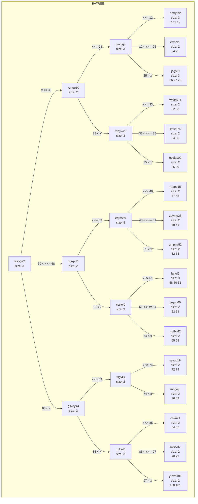

```mermaid
graph TD
subgraph B+TREE
vrkyg22[vrkyg22<br/>size: 3<br/>]
xznoe10[xznoe10<br/>size: 2<br/>]
nmqej4[nmqej4<br/>size: 3<br/>]
bmqbh2[bmqbh2<br/>size: 3<br/>7 11 12 ]
nmqej4-->|x <= 12|bmqbh2
ermev3[ermev3<br/>size: 2<br/>24 25 ]
nmqej4-->|12 < x <= 25|ermev3
ljcgs51[ljcgs51<br/>size: 3<br/>26 27 28 ]
nmqej4-->|25 < x|ljcgs51
xznoe10-->|x <= 28|nmqej4
rdpyw26[rdpyw26<br/>size: 3<br/>]
wedsy11[wedsy11<br/>size: 2<br/>32 33 ]
rdpyw26-->|x <= 33|wedsy11
tmtzk75[tmtzk75<br/>size: 2<br/>34 35 ]
rdpyw26-->|33 < x <= 35|tmtzk75
oydlc100[oydlc100<br/>size: 2<br/>36 39 ]
rdpyw26-->|35 < x|oydlc100
xznoe10-->|28 < x|rdpyw26
vrkyg22-->|x <= 39|xznoe10
ogrqx21[ogrqx21<br/>size: 2<br/>]
eqfds59[eqfds59<br/>size: 3<br/>]
nrapb15[nrapb15<br/>size: 2<br/>47 48 ]
eqfds59-->|x <= 48|nrapb15
zgymg28[zgymg28<br/>size: 2<br/>49 51 ]
eqfds59-->|48 < x <= 51|zgymg28
gmpna52[gmpna52<br/>size: 2<br/>52 53 ]
eqfds59-->|51 < x|gmpna52
ogrqx21-->|x <= 53|eqfds59
xscky9[xscky9<br/>size: 3<br/>]
bvfui6[bvfui6<br/>size: 3<br/>58 59 61 ]
xscky9-->|x <= 61|bvfui6
jaqug60[jaqug60<br/>size: 2<br/>63 64 ]
xscky9-->|61 < x <= 64|jaqug60
npfbv42[npfbv42<br/>size: 2<br/>65 68 ]
xscky9-->|64 < x|npfbv42
ogrqx21-->|53 < x|xscky9
vrkyg22-->|39 < x <= 68|ogrqx21
gsvdy44[gsvdy44<br/>size: 2<br/>]
filgt43[filgt43<br/>size: 2<br/>]
qjyuo19[qjyuo19<br/>size: 2<br/>72 74 ]
filgt43-->|x <= 74|qjyuo19
mngoj8[mngoj8<br/>size: 2<br/>76 83 ]
filgt43-->|74 < x|mngoj8
gsvdy44-->|x <= 83|filgt43
nzffs40[nzffs40<br/>size: 3<br/>]
osvri71[osvri71<br/>size: 2<br/>84 85 ]
nzffs40-->|x <= 85|osvri71
nxsfx32[nxsfx32<br/>size: 2<br/>96 97 ]
nzffs40-->|85 < x <= 97|nxsfx32
yuvrn101[yuvrn101<br/>size: 2<br/>100 101 ]
nzffs40-->|97 < x|yuvrn101
gsvdy44-->|83 < x|nzffs40
vrkyg22-->|68 < x|gsvdy44
end
```

```mermaid
graph LR
subgraph UNORDERED_HEAP
anbnd16[anbnd16<br/>size: 4<br/>34 100 101 68 ]
jiaem18[jiaem18<br/>size: 2<br/>63 53 _ _ ]
anbnd16-->jiaem18
vjbxp24[vjbxp24<br/>size: 3<br/>24 51 47 _ ]
jiaem18-->vjbxp24
fzegn31[fzegn31<br/>size: 2<br/>_ 36 _ 25 ]
vjbxp24-->fzegn31
owlsj33[owlsj33<br/>size: 2<br/>12 _ _ 72 ]
fzegn31-->owlsj33
lbngg50[lbngg50<br/>size: 2<br/>27 _ 52 _ ]
owlsj33-->lbngg50
smzae53[smzae53<br/>size: 2<br/>28 _ 39 _ ]
lbngg50-->smzae53
rqohk55[rqohk55<br/>size: 1<br/>_ 61 _ _ ]
smzae53-->rqohk55
thmwp57[thmwp57<br/>size: 1<br/>_ 58 _ _ ]
rqohk55-->thmwp57
ulyku61[ulyku61<br/>size: 3<br/>64 7 _ 32 ]
thmwp57-->ulyku61
jvaoz65[jvaoz65<br/>size: 2<br/>74 _ 59 _ ]
ulyku61-->jvaoz65
crlsn68[crlsn68<br/>size: 2<br/>_ 76 _ 84 ]
jvaoz65-->crlsn68
ehgkp73[ehgkp73<br/>size: 1<br/>_ 96 _ _ ]
crlsn68-->ehgkp73
zogmg74[zogmg74<br/>size: 1<br/>_ _ _ 35 ]
ehgkp73-->zogmg74
ktxqf79[ktxqf79<br/>size: 2<br/>26 _ _ 49 ]
zogmg74-->ktxqf79
noxhk87[noxhk87<br/>size: 3<br/>_ 85 33 83 ]
ktxqf79-->noxhk87
dakoo92[dakoo92<br/>size: 3<br/>11 97 65 _ ]
noxhk87-->dakoo92
sjedr97[sjedr97<br/>size: 1<br/>48 _ _ _ ]
dakoo92-->sjedr97
end
```
